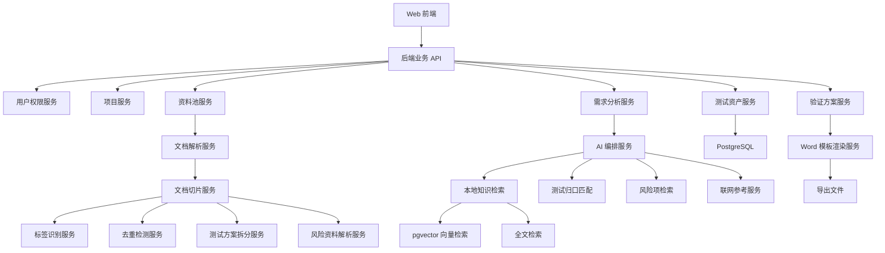

# 基因测序仪 AI 测试条目与验证方案生成工具系统架构设计

## 1. 架构目标

系统采用 Web 应用、RAG 知识库、AI 工作流编排和结构化资产库架构，支撑统一资料池、文档解析、测试方案拆分、测试条目资产、测试归口资产、风险知识源、需求分析和验证方案生成。

核心目标：

| 目标 | 说明 |
|---|---|
| 统一资料管理 | 所有资料进入统一资料池，项目通过标签和权限引用 |
| 结构化资产沉淀 | 将历史方案拆分为测试条目和测试归口包 |
| 风险驱动推荐 | 基于 Jira、DFMEA 和风险表补充测试建议 |
| 可追溯生成 | 每条推荐保留来源、依据、风险和用户决策 |
| 模板化导出 | 按既有 Word 模板生成验证方案 |

## 2. 逻辑架构



## 3. 技术栈

| 层级 | 推荐方案 |
|---|---|
| 前端 | React + Ant Design Pro |
| 后端 | Python FastAPI |
| 数据库 | PostgreSQL |
| 向量能力 | pgvector |
| 全文检索 | PostgreSQL Full Text Search，后续可升级 Elasticsearch |
| 对象存储 | MinIO |
| 后台任务 | Celery + Redis |
| 文档解析 | LibreOffice、python-docx、PyMuPDF、openpyxl |
| OCR 预留 | PaddleOCR 或 Tesseract |
| AI 编排 | 自研轻量编排，可集成 LangChain 或 LlamaIndex |
| Word 渲染 | docxtpl + python-docx |
| 部署 | Docker Compose |

## 4. 模块划分

MVP 可采用模块化单体，后续按服务拆分。

```text
backend/app/
  auth/
  projects/
  documents/
  parsing/
  knowledge/
  test_items/
  test_packages/
  risks/
  requirements/
  validation_plans/
  ai/
  templates/
```

## 5. 存储架构

| 存储 | 内容 |
|---|---|
| PostgreSQL | 用户、项目、资料元数据、标签、测试条目、归口包、风险项、方案 |
| pgvector | 文档切片、测试条目、风险项向量 |
| MinIO | 原始文件、解析文件、图片附件、导出 Word |
| Redis | 异步任务队列、短期缓存、任务状态 |

## 6. 资料处理流程

```text
用户上传文件
→ MinIO 保存原始文件
→ PostgreSQL 创建资料记录
→ Celery 触发解析任务
→ 文档解析成文本、表格和 Markdown
→ 文档切片
→ 标签识别
→ 去重检测
→ 类型专项解析
→ 用户补充标签
→ 管理员审核发布
→ 切片向量化并进入检索范围
```

## 7. 文档类型处理策略

| 文档类型 | 处理方式 |
|---|---|
| Word 验证方案 | 解析章节，按 3.x 拆分测试条目 |
| PDF 资料 | 提取文本和页码，必要时 OCR |
| Excel DFMEA | 识别表头和行，转成风险项 |
| Jira 导出表 | 识别问题、根因、复现步骤、状态、RPN |
| 测试报告 | 提取测试结论、问题、异常和数据摘要 |
| 测试规范 | 提取测试方法、判据、适用范围 |
| 技术要求 | 提取指标、参数、需求编号 |

## 8. RAG 检索架构

检索采用混合检索：

```text
权限过滤
→ 元数据过滤
→ 全文检索
→ 向量检索
→ 结果合并
→ 重排序
→ 上下文组装
```

过滤条件包括用户权限、项目资料范围、产品型号、文档状态、文档类型、子系统、测试层级和保密级别。

检索来源包括文档切片、测试条目资产、测试归口包、风险项、历史方案和测试报告。

## 9. AI 编排架构

AI 工作流拆成多个结构化任务：

```text
资料上传阶段：标签识别、文档摘要、测试方案拆分、条目分类映射、归口包生成、风险资料解析
需求分析阶段：需求解析、归口匹配、风险补充、测试推荐、条目内容补全
方案生成阶段：概述生成、DUT 抽取、测试项目详情生成、完整性校验
```

每个 AI 任务输出 JSON，并通过 Schema 校验后进入人工确认或审核流程。

## 10. 联网大模型架构

联网能力作为可选辅助通道：

```text
管理员开启联网
→ 用户需求触发外部参考
→ 系统脱敏
→ 联网模型查询
→ 标记外部参考
→ 用户审核
```

联网内容优先级低于本地知识库和测试资产库。

## 11. 验证方案生成架构

```text
审核后的测试条目
→ validation_plan JSON
→ 用户在线编辑
→ 完整性校验
→ docxtpl 渲染 Word
→ MinIO 保存导出文件
→ export_records 记录版本
```

Word 模板通过占位符和循环表格渲染文档履历、概述、DUT、参考文档、测试项目列表和 `3.x` 测试项目详情。

## 12. 权限设计

系统采用 RBAC、项目 ACL 和资料权限过滤：

| 层级 | 控制内容 |
|---|---|
| RBAC | 系统管理员、项目管理员、测试工程师、审核人员 |
| 项目 ACL | 用户能访问哪些项目 |
| 资料范围 | 项目可引用哪些资料标签 |
| 保密级别 | 用户能访问哪些保密等级 |
| 审核权限 | 谁能发布资料、资产和方案 |

每次检索必须带权限过滤。

## 13. 部署架构

MVP 推荐 Docker Compose：

```text
frontend
backend-api
worker
postgres
redis
minio
nginx
```

可选服务包括 OCR 服务和模型网关。

## 14. 质量控制

AI 输出需要经过以下校验：

| 校验 | 说明 |
|---|---|
| Schema 校验 | JSON 字段、类型、枚举、必填项 |
| 来源校验 | 测试条目需有依据或用户确认 |
| 权限校验 | 来源资料必须可访问 |
| 完整性校验 | 导出前字段齐全 |

系统应记录 Prompt 版本、模型版本、输入资料 ID、输出 JSON、用户修改记录和审核记录。
